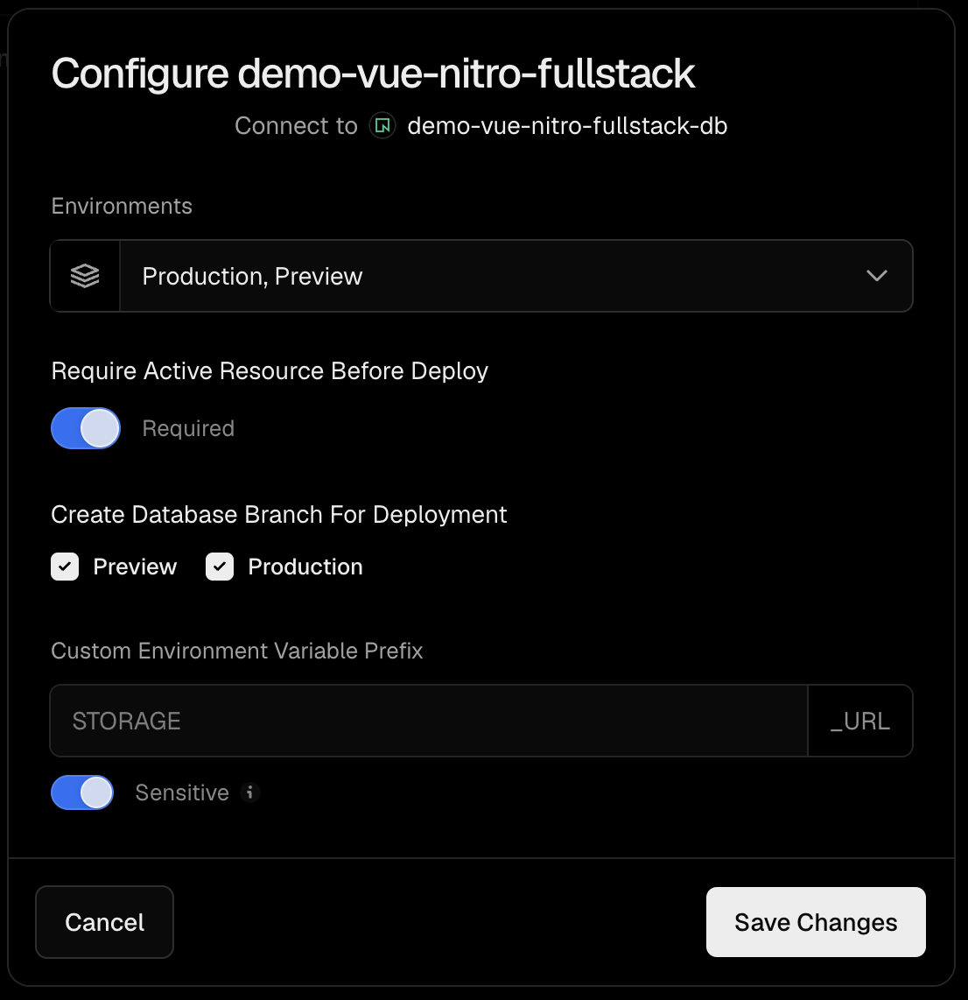

# Previews & instant rollback

This template gives every deployment its own database, using Neon's per-deployment branches — which is what makes Vercel's instant rollback safe alongside a database.

## The setup (Vercel ↔ Neon integration)

In the Neon integration's **Configure** dialog, enable **Create Database Branch For Deployment** for both **Preview** and **Production**:



Neon uses copy-on-write branching, so every deployment gets its own isolated branch (a near-instant snapshot of the parent), and Vercel injects that branch's `DATABASE_URL` into the deployment.

- **Require Active Resource Before Deploy** — a deploy only proceeds once its database branch is ready.
- Each deployment's `DATABASE_URL` points at **its own** branch, never a shared database.

## Migrations

Each deployment migrates its own branch, so the build command just runs the migration before the build:

```bash
pnpm db:migrate && pnpm build
```

(set in Vercel → Settings → Build and Deployment)

- **Preview** deploys migrate their own branch — so you can test a migration in isolation before merging.
- **Production** deploys migrate that deployment's branch.

## Instant rollback

Vercel's instant rollback reverts **code, not data**. Because each production deployment is paired with the branch it was built and migrated against, rolling back to a previous deployment also returns to the schema that code expects — no mismatch between old code and a newer schema.

Caveats:

- **Branches diverge.** Rows written after the rollback point live on the newer branch; rolling back restores the schema cleanly but does not merge that data back.
- **Cost & cleanup.** Branches use (copy-on-write) storage; preview branches are deleted with their deployment, per Vercel/Neon retention.

See [00.init-db.md](./00.init-db.md) for the database stack and local (PGlite) workflow.
